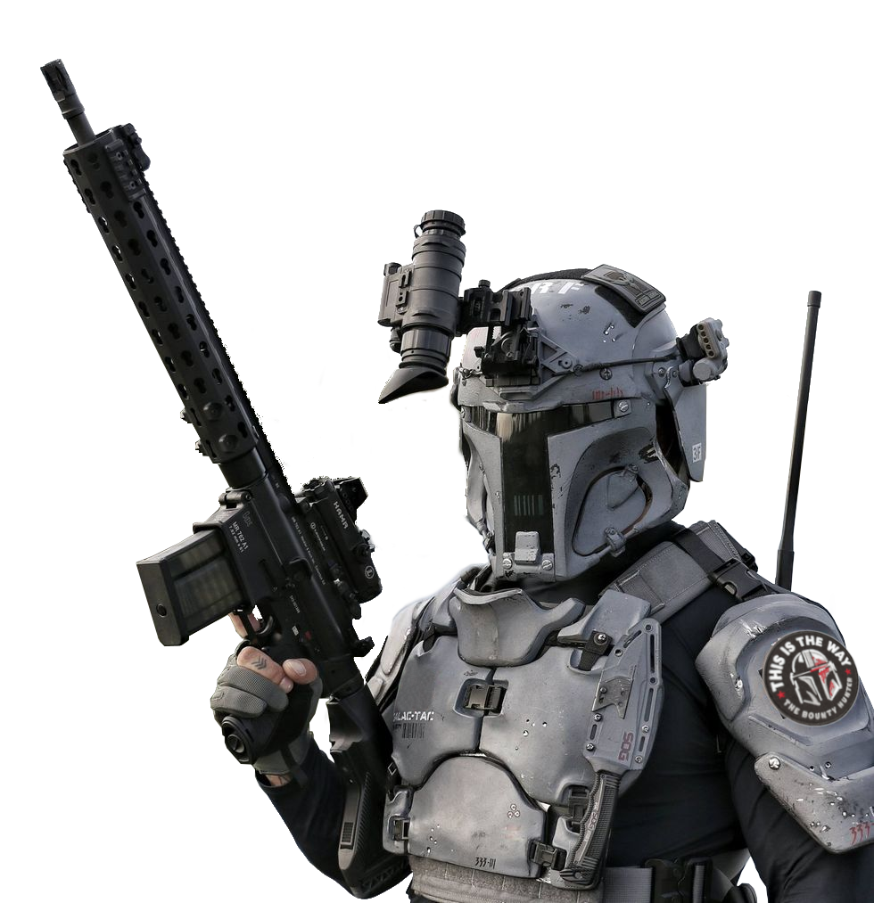
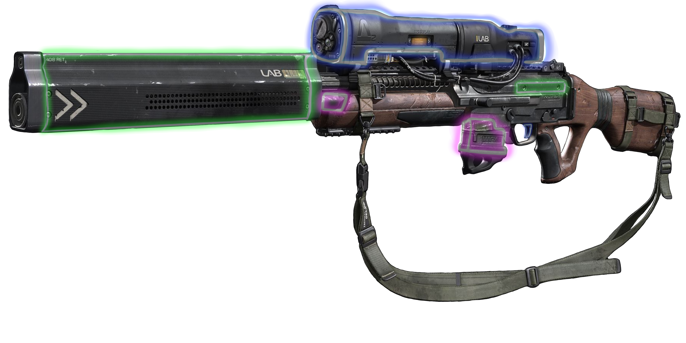

# Modifiable Items

While many enhanced items come with fixed effects. Other enhanced items, called Modifiable Items, are more customizable. 

## Modifiable Equipment
Installing modifications into a Modifiable Item requires two key components: a modification to install and the appropriate tools. An item can only be modified by someone proficient with appropriate tools, as shown in the Item Specific Tools table.

### Types of Modifiable Items
- Armor
- Blasters
- Clothing
- Focus Generators
- Lightweapons
- Shields
- Vibroweapons
- Wristpads

## Modifiable Item slots
Every *Modifiable Item* has four Modification Slots, determined by its type. A Modifiable Item only requires attunement and is considered enhanced if it has at least one modification installed.

Additionally, higher rarity *Modifiable Items* have one or more Augment Slots, according the the Augment Slots by Rarity table. 

#### Augment Slots by Rarity

|Rarity|Augment Slots|Rarity|Augments|
|:--:|:--:|:--:|:--:|
|Standard   | 0 |Advanced    | 1 |
|Premium    | 0 |Legendary    | 2 |
|Prototype  | 1 |Artifact        | 2 |

A *Modifiable Item* can only include modifications of the same rarity or a lesser rarity. For instance, if you have a prototype *Modifiable Item*, you can modify it with standard, premium, and prototype modifications. However, the item's nature does not allow it to support higher rarity modifications.

Additionally, when two or more modifications with the same effects are installed into a *Modifiable Item*, only the most potent effects apply. For example, if modification A adds +1 to damage and modification B adds +2 to damage, only the +2 to damage applies, giving the weapon +2 bonus to damage rolls rather than +3. Additionally, if modification A has +1 to damage and keen 1, it would still apply keen 1 to the item. 

However, negative bonuses are still applied, for instance: if modification A has -1 to damage and +1 to attack rolls, the -1 to damage still applies, resulting in +0 to damage with the weapon.

### Augments
Augments are a special kind of modification, intended to offer features universal across items, such as an increase to an ability score or augmenting a class feature.

Augments can only be installed into *Augment Slots*. Additionally, you cannot have two of the same augment in a single *Modifiable Item*, but you can have multiples of an augment affecting you, each in its own Modifiable Item.

***Adding Augment Slots.*** 

A character proficient in tinker's implements can add *Augment Slots* for augments to any non-consumable enhanced item. First, the character must spend one uninterrupted hour tinkering with the item, which can be done over a short rest, with their tinker's implements. The character must then make an ability check with tinker's implements. 
- On a result of less than 20, the item gains no *Augment Slots*. 
- On a result of 20 or higher, the item gains one *Augment Slot*, to a maximum of one. 
- On a result of 30 or higher, the item gains up to two *Augment Slots*, to a maximum of two *Augment Slots*. 

Regardless of your success, you must wait 24 hours before you can try adding an *Augment Slot* to the same item again.

You cannot add more than two *Augment Slots* to an item. Additionally adding *Augment Slots* to an item causes that item to require attunement, if it didn't already. Finally, an item cannot support augments of higher rarity than the item's rarity.

## Installing and Removing Modifications
Installing or Removing a modification using a *Modifiable Item* takes one hour and requires an ability check with the appropriate tool, as shown in the *Item Specific Tools table* on page \_\_\_. The DC for the check is determined by the rarity of the modification being installed, as shown below in the *Installation/Removal DC by Rarity table*.

- On a successful installation, the modification is correctly installed. On a failure, the modification is not installed, and you must wait 24 hours before you can try again.
- On a successful removal, the modification is removed and salvaged. On a failure, the modification is removed but destroyed.

##### Installation/Removal DC by Rarity
| Rarity  | Installation/Removal DC |
|:---:|:-----------:|
|Standard|10|
|Premium|14|
|Prototype|18|
|Advanced|22|
|Legendary|26|
|Artifact|30|

### Upgrading Modifiable Items
*Modifiable items* can have their rarity upgraded over time. An item can only be upgraded by someone proficient with the appropriate tools, and it can only be upgraded one rarity step at a time. Upgrading a *Modifiable item* takes eight hours and requires an ability check with the appropriate tool. The DC for the check is determined by the rarity to which the *Modifiable item* is being upgraded, as shown in the *Installation/Removal DC by Rarity table* on the previous page. Additionally, upgrading the rarity of a *Modifiable item* requires an appropriate rare material, as discussed in the *Crafting* downtime activity. Upgrading a *Modifiable item* has no effect on any modifications currently installed in the *Modifiable item*.

On a success, the *Modifiable item* is upgraded to the new rarity. On a failure, the *Modifiable item* is not upgraded, you must wait 24 hours before you can try again, and you must roll a d20. If you roll a 1 on the d20, one currently installed modification is destroyed. If the *Modifiable Item* has more than one modification installed, the GM should determine which modification is destroyed randomly.

### Variant: Common Modifications
Modifying equipment is a common expectation of adventurers foraying through the worlds of *Star Wars*. 

This rule treats all unenhanced items that can potentially be Modifiable Items, the eight categories listed earlier in this chapter, as unmodified standard rarity *Modifiable Items*. 

For example, every unenhanced blaster rifle you find while adventuring, or for sale in a market, comes with four vacant modification slots for standard rarity blaster modifications.

Additionally, all modifications of standard rarity should be available for purchase from appropriate vendors without using the *Buying Enhanced Items* downtime activity.

> Note that all *Modifiable Items* of standard rarity should be considered unenhanced for the purposes of overcoming resistance as well as distribution.
> 
> Premium or higher rarity should still be treated as enhanced items for the purposes of overcoming resistance as well as distribution.

## Engineers
Many Engineer archetypes are built around modifying a specific item, such as an Armstech or Armormech Engineer. If you have any of these engineers at the table, while using this book, you'll want to include the following rules:
- An Engineer's class-specific *Modified Item* only ever counts as one attunement, regardless of the rarity of the modifications inside it.
- An Engineer's class-specific *Modified Item* is not restricted to using *Enhanced Item Modifications* of a certain rarity. 
  - For instance, if a 4th-level armstech engineer comes across an artifact rarity blaster modification, and they are skilled enough to install it, they can benefit from it.
- An Engineer's class-specific *Modified Item* can include up to two augments, which count towards their *Total Modifications*.
- *Enhanced Item Modifications* installed into an Engineer's class-specific *Modified Item*, must still be installed over time with a successful ability check.
- An Engineer’s class-specific *Modified Item* can apply the effects of both their class-specific modifications as well as *Enhanced Item Modifications* from this book, to a maximum bonus of 3. 
  - For instance, an Armstech Engineer with their Accuracy Focus class-specific modification, as well as the Accuracy Focus Mk II enhanced modification applies the +1 to weapon attacks from both, for a total of +2 at 5th-level or +3 at 9th level, but not to +4 at 13-level. However, the bonuses from two or more *Enhanced Modifications* are still limited to the highest values and negatives are still applied.

### Biotech Engineers
The Biotech Engineering archetype however uses the following rules:
- *Enhanced Cybernetics* can be installed past your *Cybernetic Limit* (as described on page 73: Cybernetics) using your *Total Modifications* for this archetype'.
- *Enhanced Cybernetics* still count towards the *Cybernetic Side Effects table*.
- *Biotech Engineering Cybernetics* do not count towards the *Cybernetic Side Effects table*.
- Biotech Enginners can apply the effects of both their *Biotech Engineering Cybernetics* as well as *Enhanced Cybernetics* from this book, to a maximum bonus of 3.

A Biotech Engineer using the *Variant: Droids* rule from their archetype, would instead replace Enhanced Cybernetics with Enhanced Droid Customizations for the above rules.

## Color Crystals
In addition to the modifications unique to themselves, all lightweapons come with an additional slot for a color crystal. Typically, newly created lightweapons come with one of the more common color variants, such as green, blue, or red. 

Occasionally, a character might come across a more scarce color crystal. When determining what color crystal a lightweapon comes with or is found as loot, the GM can choose for the player, or have the player make a universal forcecasting ability check with proficiency. The result of the check affects the color of the crystal, as shown below in the Forcecasting Color Crystal Modifier table.

#### Forcecasting Color Crystal Modifier
|Forcecasting  Ability Check DC|d100 Roll Item modifier|
|:--:|:--:|
| 1|-15|
| 5|-10|
|10| -5|
|15|  0|
|20| +5|
|25|+10|
|30|+20|

> The **d100 Roll Modifier** is added to the percentile dice rolled for the Color Crystal table, which is discussed below.

Once a player has made their forcecasting ability check to discover a lightweapon color crystal, the player rolls percentile dice and consults the Color Crystal table below, applying a modifier based on the result of their forcecasting ability check.

##### Color Crystal

|d100|Crystal Color|d100|Crystal Color|
|:--:|:--:|:--:|:--:|
|1-20|Blue|91-93|Viridian|
|21-40|Red|94-96|Cyan|
|41-60|Green|97|Bronze|
|61-70|Yellow|98|Silver|
|71-80|Purple|99|White|
|81-90|Orange|100+|Black|

> This table includes the most common and desirable color crystals. More extensive options can be awarded at the discretion of the GM.

A player can choose the color crystal that is the result of their percentile dice rolled, or they can choose one that falls below it. For instance, if the player rolls a 91 and finds a viridian color crystal, they could instead choose a yellow color crystal, as if they had rolled a 63.

