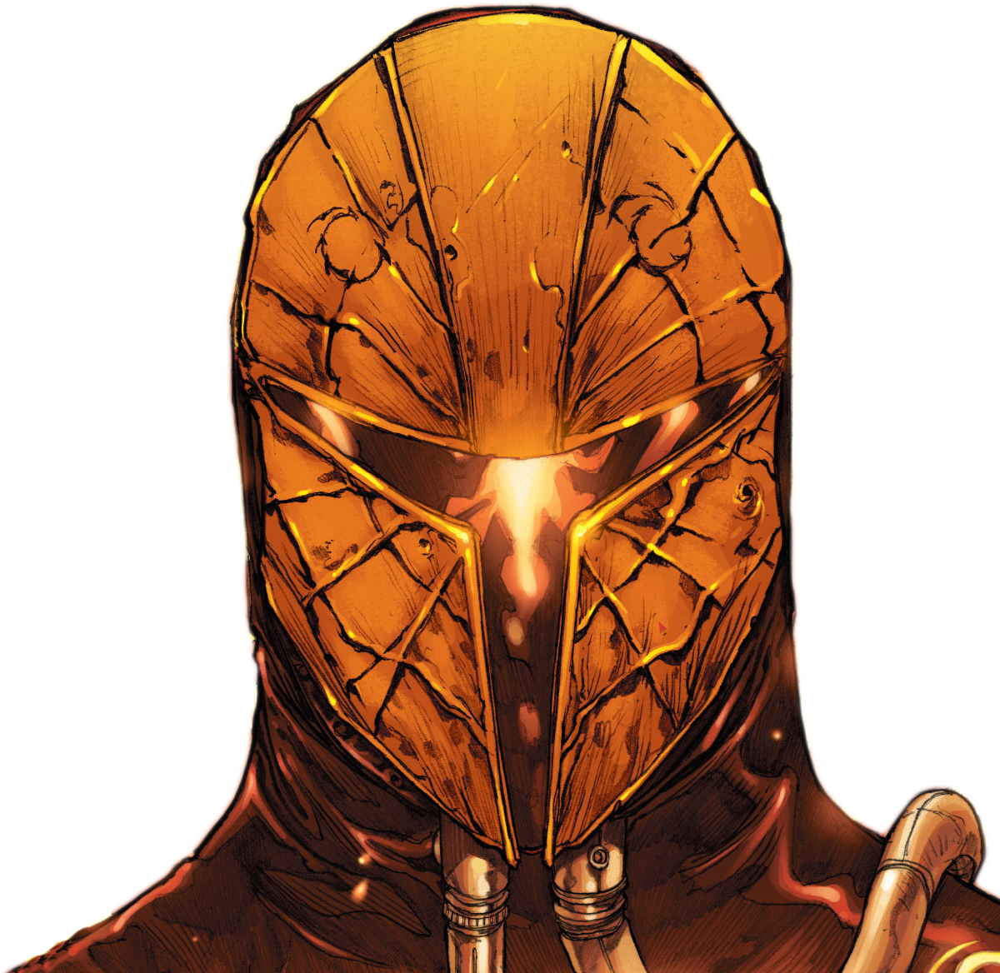

# The Mask of Mandalore 
---

*"You know what the Mask means to my people. Without it we are lost, vagabonds wandering the galaxy without a purpose. Recovering the Mask could be the key to restoring Mandalorian honor—and power. Whoever finds it will be hailed as the new leader of the clans. Mandalore will rise again, and the Mandalorians will follow."*  
―Canderous Ordo

The Mask of Mandalore was a ceremonial war mask worn by the *Mand'alor*, the traditional leader of the Mandalorian warrior clans.

The Mask of Mandalore was first worn by the Taung warrior Mandalore the First, carved from the rigid bone of a mythosaur's sternum, and modeled after the facial features of the Taung species. In time, the fabled helm became the symbol of leadership among the Mandalorians. It was passed down through the ages to those Mandalorians who proved themselves worthy of the title of Mand'alor, leader of the Mandalorian clans.

During the concluding battle of the Mandalorian Wars, the Jedi Knight Revan and Mandalore the Ultimate faced each other in single combat. Revan was the victor of the duel, after slaying his opponent, Revan and Malak traveled to the planet Rekkiad. There, Revan left the mask in a Sith's sarcophagus. By hiding the mask on Rekkiad, Revan condemned the clans to wander without a leader.

Years later, Revan and Canderous Ordo—a Mandalorian who had traveled with him during the war—traveled to Rekkiad, where many of the clans had gathered in an attempt to find the mask. When the two discovered the tomb, Revan gave Canderous the mask, telling him to reunite the Mandalorian clans to protect against the unknown enemy that Revan was chasing.  Having acquired the mask of Mandalore, Canderous began a quest to unite the Mandalorian Clans.

### The Mask of Mandalore

***Adventuring Gear** (head), artifact
  **Requires Attunement***

*A helmet with a ruddy golden color and the iconic Mandalorian T-shaped visor. For decoration, it was embossed with a series of concentric lines and above the visor, it was adorned with two emblems of the Mandalorian Crusaders.*

This mask comes integrated into a helmet and equipped with a headcomm and holorecorder. Additionally, while wearing this helmet, you have darkvision out to 60 feet.

*Mandalorian Vestments: Helmet.* While wearing and attuned to this helmet and *mandalorian armor*, you have advantage on Wisdom (Perception) checks that rely on sight within 60 feet. While wearing and attuned to this helmet, *mandalorian armor*, and *mandalorian gear*, you have advantage on Intelligence (Investigation) checks within 5 feet.

While properly attuned to and wearing Mandalore's Mask, you gain the following benefits:

**Symbol of the Manda'lor:** You have advantage on Charisma (persuasion) checks against Mandalorians 

**Charges:** Mandalore's Mask has 4 charges for the following properties, and regains 1d4 charges at the end of a long rest. You gain the following actions:

**For Mandalore!:** Using 1 charge, you rally allies within 90 feet that can hear or see you. Whenever you or a friendly creature within range makes an attack roll or a saving throw, they can roll a d10 and add the number rolled to the attack roll or saving throw. Additionally they gain temporary hit points equal to twice your Charisma modifier. This rallying cry lasts until the end of Mand'alor's next turn.

**Feared Leader:** Using 1 charge, Each creature within 90 feet of you and aware of you must succeed on a DC 20 Wisdom saving throw or become Frightened for 1 minute. A creature can repeat the saving throw at the end of each of its turns, ending the effect on itself on a success. If a creature’s saving throw is successful or the effect ends for it, the creature is immune to the masks Frightful Presence for the next 24 hours.
 

#### Attunement Condition
Mandalore's Mask is traditionally in the possession of the Manda'lor and is treasured amongst the many Mandalorian clans. To truly be the bearer of this artifact, one must follow the customs of these battle hardened people. This is either done by having it handed down to you by the current Manda'lor or by challenging the current wielder to a duel, often times to the death. Other than there being no interference, there is no other rules either combatant must contend themselves to, though this depends on the warrior. If successful in beating the current bearer of Mandalore's Mask, the recipient of the helmet is considered its rightful owner and sole ruler of the Mandalorians.

Should the mask be claimed in any other way, the user may attune to it, but they cannot use the *Symbol of The Manda'lor* feature, and the charges granted by the mask, as well risk being hunted by Mandalorian warriors who seek to reclaim their ‘stolen’ heritage. 